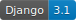
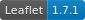

# Simple Distance Calculator






Given a reference location, this django website gives the distance between others given locations. Yes, It's very simple. It was first programmed in a hurry, during a selective process for internship at the **Federal Police of Brazil**. But it will also be very useful for me in the future for deeper studies on GeoDjango. In the next weeks it will change a lot. 

Here's a Screenshot of my basic system running:


<hr></hr>

## Dependencies needed:

- PostgreSQL 10+;

- <a href="https://docs.djangoproject.com/en/3.1/ref/contrib/gis/install/postgis/" target="_blank">PostGIS</a>;
    - GEOS, GDAL and PROJ.4.
- Docker;

- Spatial Database;

- The file `requirements.txt`, which contains all the necessary packages that can be installed by executing the command `pip install -r requirements.txt` (in a virtual environment such as `virtualenv`).

<hr></hr>

## How to run it:

First, install all the dependencies above.

After that, you will need a Spatial Database. You can use the following command to EASILY got yourself one already built previously:

```
sudo docker run --name=mydb -d -e POSTGRES_USER=dbuser -e POSTGRES_PASS=12345 -e POSTGRES_DBNAME=mygeodb -p 5432:5432 kartoza/postgis:9.6-2.4
```
Then do:

```
sudo docker container ls -a
```

In order to check if the Docker container is either running or not. 

If it's not:

```
sudo docker start database name
```

Done! Run the server inside your virtual environment using:
```
python manage.py runserver
```

<hr></hr>
This project is licensed under the MIT License - see the LICENSE.md file for details.