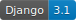
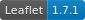
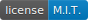
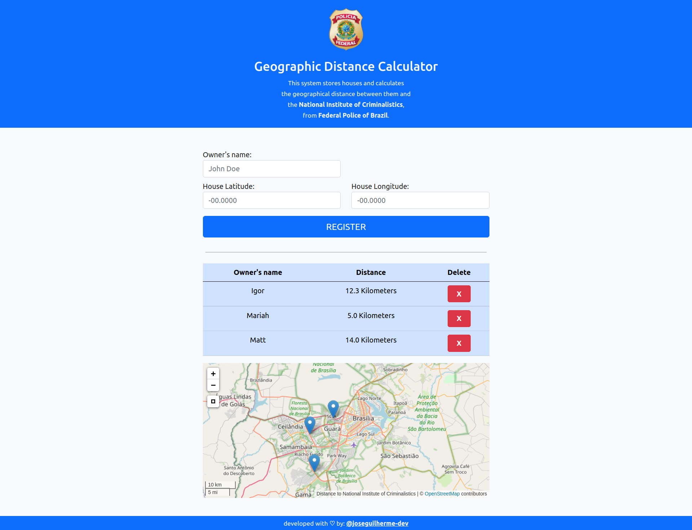

# Geographical Distance Calculator

</img>
</img>
</img>
</img>
</img>
</img>
 

### What it does:

Given a house location (latitude and longitude), the program calculates the distance to the **National Institute of Criminalistics** and shows it on screen.
It's also possible to delete the house from database.

It was first programmed during a selective process for internship at the **Federal Police of Brazil**.
The main purpose was to apply knowledges of `GeoDjango`,`Leaflet` and `PostGIS`, even if it's basic.

Here's a screenshot of the system running:




<hr></hr>

### How to Run it:

Since everything is dockerized, you must have `docker` and `docker-compose` properly installed on your system.


1. First, build and run the docker-compose:

    ```
    docker-compose up
    ```

2. Then, in another terminal tab, perform the migrations:

    Enter the container:

    ```
    docker exec -it webapp bash
    ```

    and apply the migrations:

    ```
    python manage.py migrate
    ```

3. Finnaly,  restart the container :

    Close the process or tab where the container is running and run it again:

    ```
    docker-compose up
    ```


Done! It will be running at http://0.0.0.0:8000/.

<hr></hr>
This project is licensed under the MIT License - see the LICENSE.md file for details.